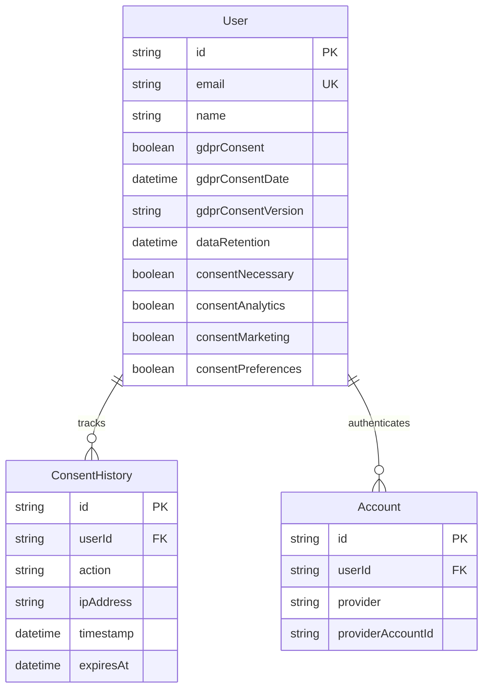
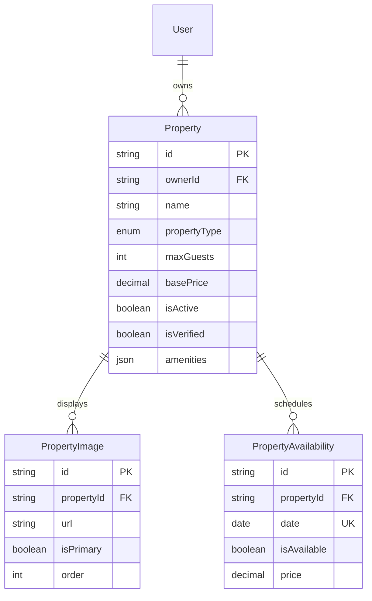
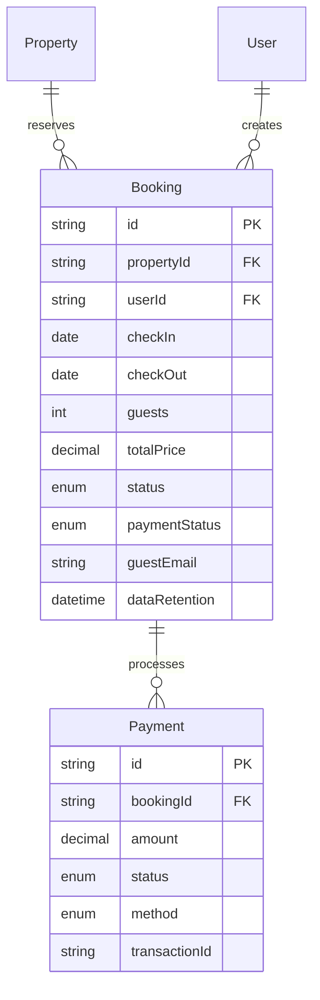
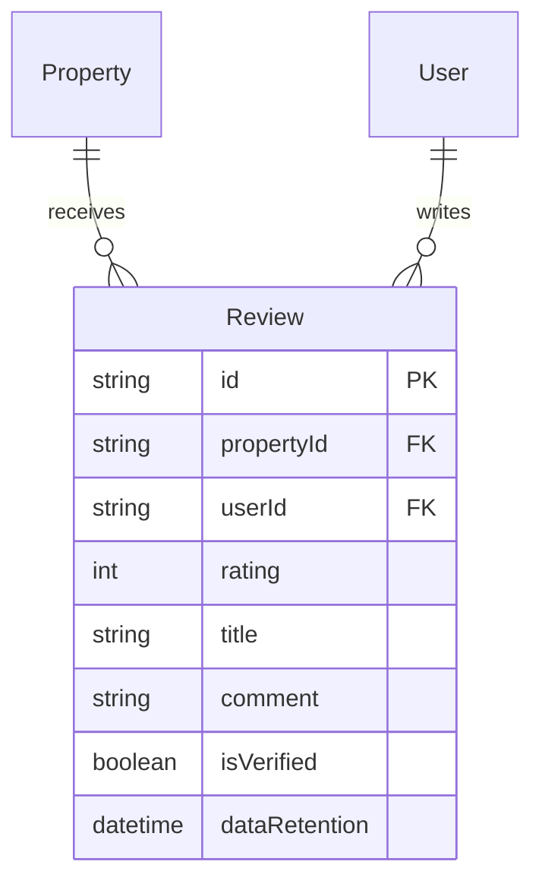
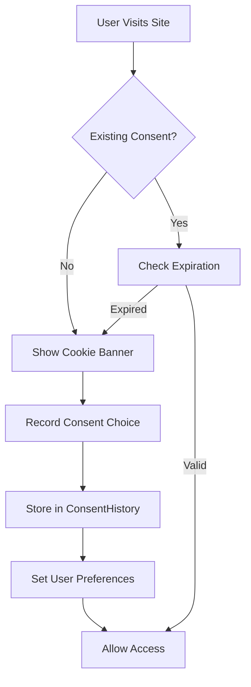

# Gastvrij Data Model Architecture

> **Target Audience**: Product Managers & System Architects  
> **Last Updated**: 2025-09-08  
> **Database**: PostgreSQL with Prisma ORM

## Executive Summary

Gastvrij operates on a **privacy-first hospitality management platform** with comprehensive GDPR compliance built into the data model. The system supports property management, booking operations, payment processing, and guest reviews across multiple languages (Dutch, French, German, English).

### Key Business Capabilities
- Multi-property rental management
- Secure booking & payment processing  
- GDPR-compliant guest data handling
- Granular consent management with audit trails
- Multi-language support for European markets

### Compliance Features
- **GDPR Article 7**: Explicit consent tracking with audit trails
- **Right to be Forgotten**: Automated data retention policies
- **Data Portability**: Structured data exports
- **Consent Granularity**: Separate tracking for necessary, analytics, marketing, and preference cookies

---

## Core Domain Models

### 1. User Management & Authentication

**Business Purpose**: Secure user authentication with granular GDPR compliance

**Key Features**:
- **NextAuth.js Integration**: OAuth providers (Google, Facebook, etc.)
- **Granular Consent**: 4 categories (necessary, analytics, marketing, preferences)
- **Consent Versioning**: Track policy changes over time
- **Audit Trail**: Complete history of consent changes with IP/user agent
- **Data Retention**: Automatic deletion scheduling per GDPR requirements

**Privacy Controls**:
- Anonymous consent tracking (nullable userId)
- IP address logging for consent verification
- Consent expiration dates
- Version tracking for policy updates

### 2. Property Management

**Business Purpose**: Multi-property rental inventory management

**Key Features**:
- **Property Types**: Apartment, House, Studio, Room, Villa, Chalet
- **Dynamic Pricing**: Date-specific price overrides
- **Image Management**: Primary image designation with ordering
- **Geolocation**: Latitude/longitude for mapping
- **Verification Status**: Quality control flag

**Operational Benefits**:
- Real-time availability tracking
- Flexible pricing strategies
- Multi-media property presentation
- Owner relationship management

### 3. Booking & Payment System

**Business Purpose**: End-to-end booking lifecycle with secure payment processing

**Key Features**:
- **Booking Status Flow**: Pending → Confirmed → Completed/Cancelled/No-show
- **Payment Methods**: Card, Bank Transfer, PayPal, iDEAL, Bancontact (EU focus)
- **Payment Status**: Full refund and partial refund support
- **Guest Information**: GDPR-compliant storage with retention policies
- **Multi-currency**: EUR default with currency flexibility

**Revenue Protection**:
- Transaction ID tracking
- Payment method diversity
- Refund management
- No-show tracking

### 4. Review & Reputation System

**Business Purpose**: Trust-building through verified guest feedback

**Key Features**:
- **Rating System**: 1-5 star ratings
- **One Review Per Stay**: Unique constraint (propertyId, userId)
- **Verification Flag**: Distinguish verified stays from general reviews
- **GDPR Compliance**: Automatic data retention for review content

---

## Data Relationships & Business Rules

### Primary Entity Relationships

1. **User-Centric Design**
   - Users can own multiple properties
   - Users can make multiple bookings
   - Users can review properties they've stayed at
   - Complete user deletion cascades appropriately

2. **Property-Centric Operations**
   - Properties have dedicated availability calendars
   - Properties support multiple images with ordering
   - Properties can receive multiple bookings and reviews

3. **Booking Lifecycle**
   - Bookings connect properties with guests
   - Multiple payment records per booking (deposits, final payments)
   - Guest information stored with GDPR retention policies

### Critical Business Constraints

- **Booking Dates**: CheckOut > CheckIn enforced at application level
- **Availability**: Booking dates must align with PropertyAvailability
- **Review Authenticity**: One review per user per property
- **Payment Integrity**: Sum of payment amounts must match booking totalPrice
- **GDPR Compliance**: All personal data has retention policies

---

## GDPR Compliance Architecture

### Data Subject Rights Implementation

| GDPR Right | Implementation |
|------------|----------------|
| **Consent (Art. 7)** | Granular consent categories with version tracking |
| **Access (Art. 15)** | Complete user data export via API |
| **Rectification (Art. 16)** | User profile self-service editing |
| **Erasure (Art. 17)** | Automated deletion via dataRetention fields |
| **Portability (Art. 20)** | JSON export of all user-related data |
| **Objection (Art. 21)** | Consent withdrawal with audit trail |

### Consent Management Strategy

### Data Retention Policies

- **User Accounts**: 7 years post-deletion request
- **Booking Records**: 10 years for financial/legal compliance
- **Review Data**: 5 years for reputation integrity
- **Consent History**: Permanent for legal compliance
- **Payment Records**: 7 years for financial regulations

---

## Technical Architecture Decisions

### Database Design Rationale

| Decision | Rationale | Business Impact |
|----------|-----------|-----------------|
| **PostgreSQL** | ACID compliance, JSON support, European hosting options | Data integrity, GDPR compliance |
| **CUID IDs** | Collision-resistant, URL-safe, sortable | Scalability, security |
| **Decimal Pricing** | Exact monetary calculations | Financial accuracy |
| **Enum Types** | Type safety, clear business states | Reduced bugs, clear workflows |
| **Cascade Deletes** | GDPR right to erasure | Compliance automation |

### Internationalization Support

- **Multi-language Ready**: Schema supports localized content
- **Currency Flexibility**: EUR default with multi-currency support  
- **Regional Payment Methods**: iDEAL, Bancontact for European markets
- **Cultural Adaptation**: Date/time formats per locale

### Scalability Considerations

- **Indexed Fields**: email, sessionToken, property dates
- **Partitioning Ready**: PropertyAvailability by date range
- **Caching Strategy**: Property and availability data
- **API Design**: RESTful with GraphQL consideration

---

## Security & Privacy Controls

### Data Protection Measures

1. **Encryption at Rest**: All sensitive fields encrypted
2. **Access Control**: Role-based permissions (Owner, Guest, Admin)
3. **Audit Logging**: Complete consent and payment audit trails
4. **Session Management**: Secure JWT with NextAuth.js
5. **Input Validation**: Zod schemas for all user inputs

### Privacy-by-Design Features

- **Data Minimization**: Only collect necessary information
- **Purpose Limitation**: Clear consent categories
- **Transparency**: Open consent policies and data usage
- **User Control**: Self-service privacy preferences
- **Automated Compliance**: Scheduled data retention cleanup

---

## Performance Optimization Strategy

### Database Optimization

- **Connection Pooling**: Prisma connection management
- **Query Optimization**: N+1 prevention with includes
- **Index Strategy**: Compound indexes on frequently queried fields
- **Caching Layer**: Redis for property availability and pricing

### API Performance

- **Server Components**: Reduced client-side data fetching
- **Static Generation**: Property listings and search pages
- **Image Optimization**: Next.js automatic image optimization
- **CDN Strategy**: Global asset distribution

---

## Future Roadmap Considerations

### Phase 2 Enhancements

1. **Multi-tenant Architecture**: Property management companies
2. **Advanced Pricing**: Dynamic pricing algorithms
3. **Communication Hub**: Guest-host messaging system
4. **IoT Integration**: Smart lock and sensor integration
5. **Analytics Dashboard**: Business intelligence for owners

### Scalability Planning

- **Microservices Transition**: Booking, payment, and property services
- **Event Sourcing**: Booking state change auditing
- **CQRS Implementation**: Read/write optimization
- **Multi-region Deployment**: European data residency

---

*This document serves as the authoritative source for understanding Gastvrij's data architecture. All development decisions should align with these principles and compliance requirements.*